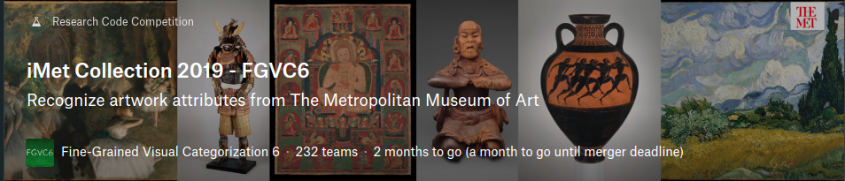

# iMet-Collection2019-FGVC6-Baseline


竞赛官网: [https://www.kaggle.com/c/imet-2019-fgvc6/overview](https://www.kaggle.com/c/imet-2019-fgvc6/overview)

## Dataset
* 每种属性的图像数量:

  <div align=center></div>

* 标签数量-图像数量分布:

  <div align=center></div>

* 存在大量长宽比相差很大的图像
  
  
  

## ENVS
* Ubuntu16.04
* python==2.7/3.5/3.6
* pytorch==0.4.1/1.0
* torchvision
* sklearn

## File Structure
```
iMet-Collection2019-FGVC6-Baseline/
▾ data/
    train.csv
    valid.csv
▾ dataset/
    __init__.py
    augmentation.py
    create_img_list.py
    dataset.py
    EDA.py
    transforms.py
▾ metrics/
    __init__.py
    metric.py
▾ networks/
    __init__.py
    lr_schedule.py
    network.py
▾ utils/
    __init__.py
    label_smooth.py
    plot.py
    seed_everything.py
  __init__.py
  config.py
  inference.py 
  README.md
  train.py
```
## Network Architecture
ResNet18+FC(1103)

损失函数: BCEWithLogitsLoss

优化器: Adam

## RUN
* STEP0
  ```
  git clone https://github.com/xungeer29/iMet-Collection2019-FGVC6-Baseline
  cd iMet-Collection2019-FGVC6-Baseline
  ```
* STEP1
  添加文件搜索路径，更改数据集根目录

  将所有的`.py`文件的`sys.path.append`中添加的路径改为自己的项目路径

  更改`config.py`中的`data_root`为数据集存放的根目录

* STEP2
  Exploratory Data Analysis(EDA)
  ```
  python EDA.py
  ```
  注: 更改不同的注释进行不同的数据集性质分析
* STEP3
  划分训练集和本地验证集

  ```
  python dataset/create_img_list.py
  ```

* STEP3
  train

  ```
  python train.py
  ```

* STEP4
  inference
  ```
  python inference.py
  ```

## TODO
* Data Argumentation: 
  * 存在长宽比很大的细长型图像，采用padding的方式改变图像大小
  * 随机擦除
* data distulation
* OHEM

## Experiments
